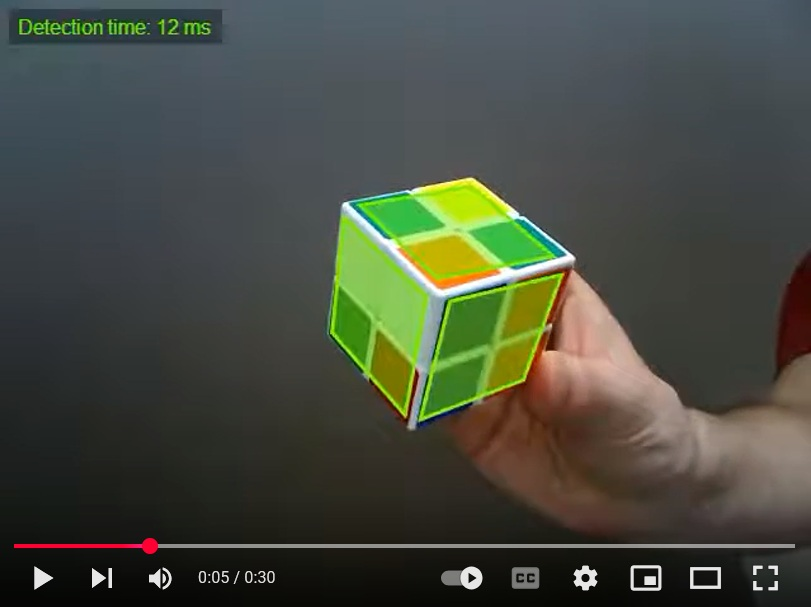

Real-Time Pocket Cube Detection
===============================
_September 8, 2015_

This is about an application for detection of a pocket cube from a webcam.
[Pocket cube](http://en.wikipedia.org/wiki/Pocket_Cube) is the 2×2×2
equivalent of a Rubik's cube.

Plenty of new features from Javascript and HTML5 have been used, such as API
for webcam support and multi-threading (web workers). As the application uses
very advanced features from HTML5 and Javascript, some modern browsers will
not be capable to support this application. The newest version of Chrome
should be sufficient.

If you have a pocket cube you can try the [app](app).

For the demo please refer to the following video.

The upper left corner of the stream window shows the time which is spent for
cube detection on each frame.

As a side effect, this project shows that Javascript language has evolved
enough so the most complex calculations, such as pixel based manipulations
and image processing algorithms, could be done in real-time.

About the Implementation
------------------------

Streaming from the webcam is done in the main thread, while image analysis
(cube detection) in the background thread.

Cube detection is done on every frame independently from previous frames. For further
enhancements some [optical flow](http://en.wikipedia.org/wiki/Optical_flow) method might
be added to significantly improve accuracy of detection and reduce flickering.

There is no library used for image processing. Everything is done from scratch
for two reasons. First reason is to have better performance. The second
is that implementing algorithms that involve pixel based manipulation is fun!

The whole application runs in the browser. There is no communication with the
server whatsoever (other than initial page load, of course).

For this project the following list of algorithms has been implemented. Some
of them have been discarded due to changes in the course of development.

- [Image segmentation](http://en.wikipedia.org/wiki/Minimum_spanning_tree-based_segmentation)
  based on Kruskal's minimum spanning tree algorithm (expanded to the project
  [Real-Time Image Segmentation](https://lukapopijac.github.io/real-time-image-segmentation/))
- [Connected-component labeling](http://en.wikipedia.org/wiki/Connected-component_labeling)
- Algorithms for manipulating convex polygons ([Convex hull](http://en.wikipedia.org/wiki/Graham_scan),
  polygon simplification, polygon intersection, ...)
- [Hough transform](http://en.wikipedia.org/wiki/Hough_transform) for line detection
- [Gradient descent algorithm](http://en.wikipedia.org/wiki/Gradient_descent)
